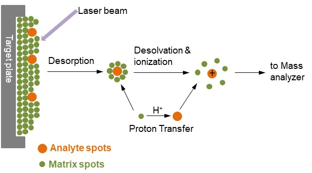

# Mass Spectrometry: MALDI-TOF

- Mass spectrometers analyze charged protein or peptide molecules in the
gaseous state. A key step is to transfer proteins into the gas phase and ionize
them.

- Mass‐to‐charge ratio (m/z) of an ion determines the time taken to the
detector; Time‐of‐flight spectrum is recorded - AA composition of a femtomole of peptide can be deduced

## Mass spectrometry is an analytical technique in which samples are ionized into charged molecules and ratio of their mass-to-charge (m/z) can be measured. In MALDI-TOF mass spectrometry, the ion source is Matrix-Assisted Laser Desorption/Ionization (MALDI), and the mass analyzer is time-of-flight (TOF) analyzer.

MALDI-TOF

- The spectrometer itself is built from three parts: an ion source, a mass analyzer, and a detector.
- From data analysis point of view the most important is the ion source.
- The most popular solutions are electrospray ionization (ESI) and matrix-assisted laser desorption
 and ionization (MALDI).